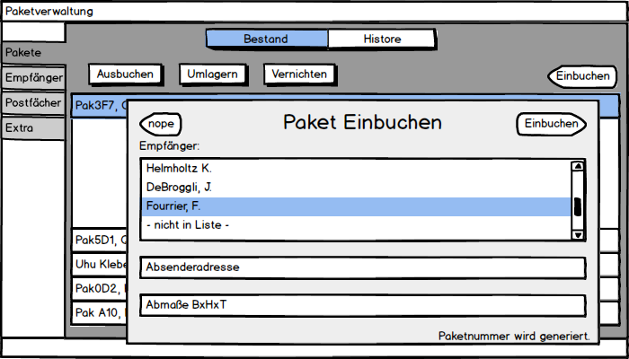

#Pflichtenheft, Kurzfassung
Dieses Dokument repräsentiert ein kurzes Pflichtenheft für ein Softwareprojekt im Rahmen der Ausbildung zum Fachinformatiker Anwendungsentwicklung im dritten Lehrjahr. In Folgenden erläutern wir die Problemstellung und wie wir an diese herantreten wollen.
###Team
Die _Gruppe 7_ aus der Klasse FA26 besteht aus

* Nicolas Tietz
* Katrin Wistuba
* Tom Zimmerlinkat

##Problemstellung
Mit Hilfe dieser Software soll ein Postfachverwaltung für eine firmeninterne Poststelle ermöglicht werden. Sendungen und Pakete werden angenommen, freie Postfächer ermittelt, in designierten Postfächern zwischengelagert und später wieder an den Empfänger ausgegeben. Es ist möglich sich alle eingelagerten Pakete anzeigen zu lassen. Ein- und Ausgabevorgänge werden protokolliert.
Der Funktionsumfang wird bewusst schlicht gehalten. Besondere Sicherheitsfunktionen wie z.B. Nutzerverwaltung und Authentifizierung werden nicht implementiert da das Nutzungsszenario in einer vertrauten Umgebung stattfindet.

##Datenhaltung
Die Primäre Datenhaltung soll in einer relationalen SQL Datenbank erfolgen (MySQL o.ä.).
Darüber hinaus soll eine zweite Lösung mit einer In-memory-Datenbank präsentiert werden, diese hat ein XML Speicher zwischen Sitzungen als Sicherung.
Ein Abgleich beider Datenhaltungen ist erstmal nicht vorgesehen.

##ER-Modell

##User interfaces
Es sollen zwei verschiedenartige Nutzerschnittstellen zur Verfügung gestellt werden.

###GUI
Eine graphische Oberfläche die "nativ" von der Applikation ausgegeben wird für eine fensterbasierte Arbeitsumgebung. Diese bietet Möglichkeiten alle wichtigen Funktionen auszulösen. Darüber hinaus ist es komfortabel möglich den Datenbestand einzusehen.
Beispielhaft wird hier die ]Liste der eingebuchten Pakete, das Einbuchen eine Paket und ein Konfigurationspanel gezeigt.

###CLI
Auch ein Text-basiertes Komandozeilen-Interface soll ebenfalls aufgerufen werden können. Auch hier sollten alle Hauptfunktionen nutzbar sein. Die Bedienung erfolgt über ein  Knopf-zu-Funktion System. Eine interaktive shell ist nicht vorgesehen.

##Testszenarien
* Das CLI wird aufgerufen und Datenbestand wird angezeigt.
* Über das CLI wird ein neues Empfänger angelegt.
* Über das CLI wird ein neues Paket eingebucht und in ein freies Postfach abgelegt
* Über das CLI wird ein Paket aus einem Postfach entnommen, an einen Empfänger ausgegeben
* Über einen Programmneustart hinweg sind Daten konsistent abrufbar.
* Die GUI wird aufgerufen und Datenbestand wird angezeigt.
* Über die GUI wird ein neues Paket eingebucht und in ein freies Postfach abgelegt
* Über die GUI wird ein Paket aus einem Postfach entnommen, an einen Empfänger ausgegeben
* Die Applikation wird auf die 2. Datenhaltung umkonfiguriert und obige Testszenarien

##Meilensteine
1. Pflichtenheft liegt vor (02.10.)
* Technologieframework wurde festgelegt (11.10)
* Ein Designpattern für das Fachkonzept (Die business Logic) wurde ausgewählt (18.10)
* Die Schnittstellendefinition zwischen den Schichten liegt in einer ersten vollständigen Version vor (25.10)
* Die Datenhaltung in der Relationalen Datenbank über die Schnittstelle ist möglich (4.11.)
* Die Kommandozeilenbedienung der Schnittstelle ist möglich (4.11.)
* Die graphische Oberfläche bietet alle Funktionen (25.11.)
* Die in-memory (2.Datenhaltung) Datenbank ist beschreibbar (27.11)
* Es ist einfach möglich Komponenten des Projekt auszutauschen (27.11.)
* Präsentation und Abschluss des Projekt (18.12.)

##Aufgabenaufteilung
* Arbeitsumgebung bereitstellen (Versionsverwaltung, Aufgabenverwaltung) -> Tom
* Fachkonzept -> Nicolas, Tom
* Schnittstellendefinition -> alle
* Datenhaltung
	* Relationale Datenbank -> Tom
	* in-memory Datenbank -> Nicolas
* Bedienuberflächen
	* CLI -> Tom
	* GUI -> Katrin
